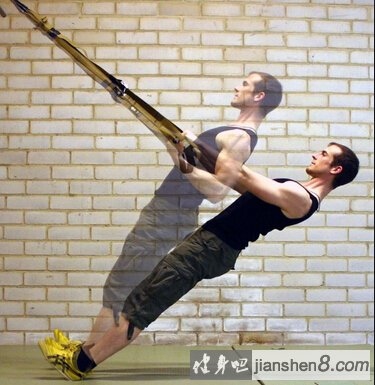

# 健身基础知识

- [私教必须收藏的50张肌肉训练图！(强烈推荐)](https://zhuanlan.zhihu.com/p/75115799)

## 健身知识

- 证书可以证明一个教练的水准，请出示证书：国内的请出示带国徽的证书，国外请出示带ncca标的证书，其他的一律按无证处理。
- ~~如果你每周的健身三大项卧推、硬拉、深蹲都能保质保量的完成，那么理论上你的腹肌都不需要单独训练，因为你的核心完全可以保持应有的强度。~~ 核心和腹部还是需要单独训练。
- 力量训练
  - 刚开始，每周3次，每个动作4组，每组10次，组间休息2分钟。
  - 后面加重量，每组5-8次。
  - 每次练两个动作。周一胸&三头，周三背&二头，周五肩部&腿。
  - 每个肌肉每周需要练习12组。以胸部锻炼为例，上斜卧推4组、平板卧推4组、双杠臂屈伸4组。所以至少要做3个动作。
  - 每次锻炼一小时足够，需要控制每组休息时间。
- 有氧。
  - 做有氧比少吃一顿舒服。
  - 能保持心肺健康，如果跑一公里都气喘吁吁，不管肌肉有多大，看着都像个SB一样。
  - 每周2-3次。撸铁后每次20-30分钟。
  - 间歇式训练。快跑20s，慢跑或走40-60s。重复10-15轮。除了爬楼，跑步机、椭圆机、户外、自行车都行。
    - 有趣
    - 节约时间
    - 据说它比传统有氧燃脂多一点
- 饮食
  - 吃健康的实物。水果、蔬菜、土豆、米饭、豆等等。
  - 避开不健康的食物。糖、饮料等等。
  - 每天摄入大概2000卡热量。健身可以多摄入500卡，体重比较大可以少摄入500卡。

## 一些名词

### RM

**概念**
- repetition maximum
- 最高重复次数
- 150KG的深蹲重量，你只能完成1次，无法完成第二次，那么这个重量就是你的1RM！

**根据 RM 和组间休息的时间，可以针对不同的目的采取不同的训练**

- **以绝对力量、爆发力为主的训练**，主要采取1~5RM的训练重量次数，采取2-5分钟的组间休息。
- **以肌肉体积增长、无氧耐力增加为主的训练**，主要采取8~ 12RM的训练重量次数,采取30秒到90秒的组间休息。
- **以减少体脂、增强有氧能力和无氧耐力的训练**，主要采取15~ 20RM的次数,组间休息10秒到30秒。

### 颈前深蹲

### 拉伸

### 屈髋

简单说就是撅屁股。[参考链接](https://zhuanlan.zhihu.com/p/29587961)

### 离心收缩、向心收缩

> 离心收缩发生在肌肉在张力作用下伸长的时候，而向心收缩发生在肌肉在张力作用下缩短的时候——肌肉不会“弯曲”，它们只能收缩。

## 健身房器械大全

### 引体向上训练器

### 大腿内收机

主要训练肌群是大腿内收肌（大收肌、长收肌、短收肌、股薄肌及耻骨肌等）。

### 坐姿划船器

目标肌群：背部肌群

### 高位下拉器

训练功能：高位下拉（宽握，窄握）

目标肌群：背部肌群

### 反向蝴蝶机夹胸

目标肌群：三角肌后束

### 蝴蝶机

目标肌群：胸肌（胸中缝）

### 坐姿推胸训练器

### 卧式后屈腿训练器

### 坐式屈腿训练器

### 龙门架

### 史密斯机

### 腿举器（leg press）

### 汉克深蹲器（hack squat）

类似于腿举器，健身者在使用时为站姿（背部紧靠靠背）。

### 杠铃

### 曲杆杠铃

### 壶铃

### 平板卧推

### 上斜卧推

### 下斜卧推

### 肩部推举

### 牧师凳

### 深蹲架（squat rack）

类似于力量架。

### 波速球

### TRX

TRX 是 Total Resistance Exercise 的缩写，即“全身抗阻力锻炼”的意思，然而健身界似乎更喜欢称其为“悬挂训练系统”。

TRX 一直致力于为用户提供全面、创新的训练课程和动作设计。

